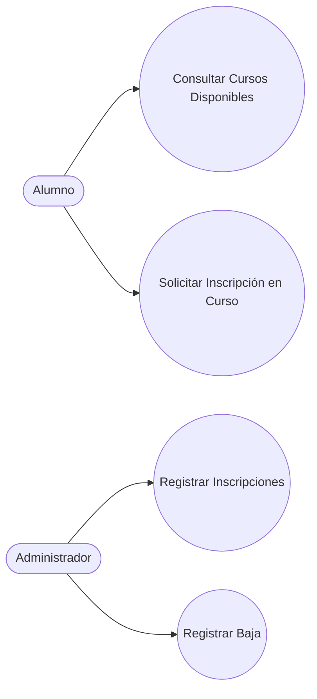

```mermaid
graph LR
    actorAlumno([Alumno])
    actorAdministrador([Administrador])

    casoConsultarCursosDisponibles((Consultar Cursos Disponibles))
    casoSolicitarInscripcionCurso((Solicitar Inscripción en Curso))

    casoRegistrarInscripciones((Registrar Inscripciones))
    casoRegistrarBajaAlumno((Registrar Baja))


    actorAlumno --> casoConsultarCursosDisponibles
    actorAlumno --> casoSolicitarInscripcionCurso

    actorAdministrador --> casoRegistrarInscripciones
    actorAdministrador --> casoRegistrarBajaAlumno


```
